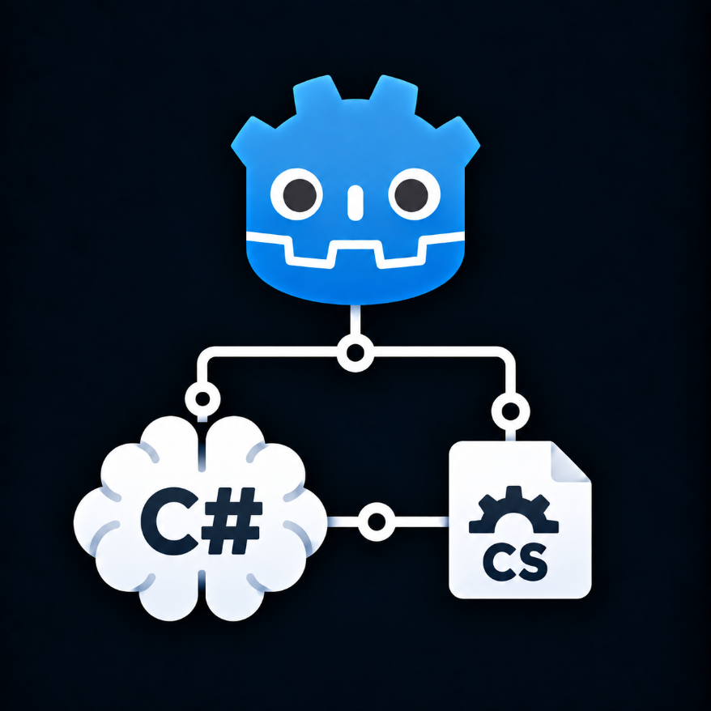

<p align="center">
  <a href="https://github.com/FootClanSoldier/SystemExplorer.CodeService">
    
  </a>
</p>
<h1 align="center">SysemExplorer.CodeService</h1>

> SystemExplorer.CodeService is currently in early development.
>
> The service is being built as the future code-intelligence backend for System Explorer.

---


SystemExplorer.CodeService is the standalone code-intelligence backend for the System Explorer Godot editor plugin. It runs outside the Godot process so workspace, indexing, and Roslyn-host lifetime can remain independent of editor/plugin reloads.

## Requirements and installation

SystemExplorer.CodeService targets .NET 10 and is distributed as a .NET Tool:

```text
dotnet tool install --global SystemExplorer.CodeService
```

The installed command is:

```text
system-explorer-code
```

The service is normally started and owned by the System Explorer plugin. Server mode validates the exact Godot owner process identity and retires when that owner lifetime ends.

## Private Roslyn runtime

The win-x64 tool package includes the SystemExplorer private patched Roslyn Language Server runtime. Normal users on Windows x64 do not need to install Roslyn separately or pass a Roslyn path.

`--roslyn-runtime <absolute-directory>` remains an explicit development/test override for controlled fixed-runtime verification. Packaged Roslyn provisioning in this version is supported only on Windows x64; on unsupported platforms the service retains its indexing-only behavior.

## Server startup configuration

Canonical server-mode syntax is:

```text
system-explorer-code server
    --godot-pid <pid>
    --godot-start-time-utc-ticks <ticks>
    [--project-root <absolute-project-root>]
    [--startup-document <project-relative-cs-path>]
    [--diagnostic-log]
    [--roslyn-runtime <absolute-directory>]
```

`--startup-document` is an optional, best-effort performance hint. It accepts only the bounded project-relative CodeService `.cs` wire-path form (forward slashes, no rooted/drive path, no `.`/`..` segments) and is usable only together with an accepted `--project-root`. A semantically invalid startup-document hint is rejected without preventing normal Service startup.

When accepted, the startup workspace may read that document from disk within the normal document text bound, speculatively track it in the current Roslyn generation with `didOpen` version 1, and issue the normal `CompilerSemanticOnly` document diagnostic so the private Roslyn completion/import-completion readiness continuation can run before workspace publication. This speculative state is not managed editor authority and does not create a SemanticReady proof. Later managed epoch/snapshot synchronization remains authoritative: identical text adopts the existing Roslyn open, unsaved differing text advances with `didChange`, and an epoch that excludes the document closes/removes it.
